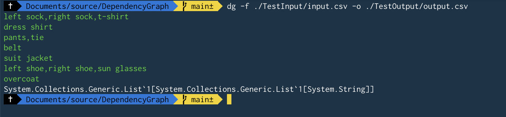

# Dependency Graph Solver

## Solution contents
Dependency Graph solution contains the following projects
- ***Dependency Graph*** a library which takes an input of items and their dependencies. Using the input provided the library forms a directed graph which can traverse the dependencies and list out items in the topological order of their dependencies.
- ***CLI*** this is a dotnet tool which encapsulates the Dependency Graph Solver library. This tool can accept csv files as input and produces an output csv file if the inputs are valid and do not contain a cycle. The tool will output the correct result (or any errors) on the console in addition to generating output file.
- ***Dependency Graph Tests*** this project houses the unit tests to test the library with different valid and invalid inputs.
- ***Dependency Graph CLI Tests*** this project houses the CLI tests which can invoke the tool commands directly or at a process level. These are integration / E2E tests which take input csv file and generate output files which get cleanedup after test execution.

## Performance analysis
 - ***Time Complexity*** : O(V+E) where 'V' is the number of vertices, or distinct number of items and 'E' is the number of edges or the number of dependency for each item. In our algorithm we iterate over every item once and we iterate over its dependencies once as well.
 - ***Space Complexity*** : O(V+E) we create an adjacency list which contains every item in the key and the value contains a list of all the dependencies of that item. 

## Build and run tests
This can be done from Visual Studio or from the dotnet cli like below 

```bash
dotnet build
dotnet test
```

## Tool Installation and Usage

Navigate to the DependencyGraph.CLI directory

```bash
# pack the tool as nuget
dotnet pack

# install the tool to be used globally
dotnet tool install --global --add-source ./nupkg DependencyGraph.CLI

# Use Dependency Graph tool
# tool invoke keyword - dg
# invoke Dependency Graph Help
dg -h

# invoke Dependency Graph Solver Command
dg -f ./TestInput/input.csv -o ./TestOutput/output.csv
 
```

## Screenshots of tool usage

Help Command


Dependency Graph solver with a valid input


Dependency Graph solver with an invalid input

